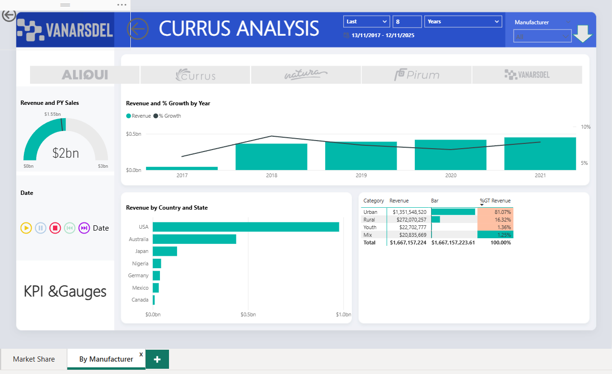

# Global Multi-Source PowerBI Sales Analytics Dashboard  
### Business Analytics • Power Query • Data Modeling • DAX • PowerBI Dashboard

This project showcases end-to-end data modeling and dashboard development in **PowerBI**, using multi-country sales data to build an enterprise-grade analytics report.

Even though the full PBIX file exceeds GitHub’s 100MB upload limit, detailed screenshots and documentation below fully demonstrate the work, features, and insights.

---

## 📊 Dashboard Overview

### **Market Analysis (Page 1)**  

**Features:**
- Global map visualization (Bing Maps)  
- Manufacturer growth comparison  
- Multi-year revenue trend  
- Bubble map of global revenue distribution  
- Segment-level % growth (bubble chart)  
- Dynamic date slicers & filters  

---

### **By Manufacturer Analysis (Page 2)**  

**Features:**
- Revenue & prior year KPI gauge  
- Revenue growth year-over-year  
- Country-level revenue comparison  
- Category revenue with %GT breakdown  
- Manufacturer slicers  
- Interactive controls for date, manufacturer, and category  

---

## ⭐ Final Data Model (Star Schema)

The underlying model includes:

- **Sales (Fact Table)**  
- **Date Table (DAX-Generated)**  
- **Product Dimension**  
- **Manufacturer Dimension**  
- **Geography Dimension**

All relationships are **one-to-many**, following star-schema best practices.

---

## 🛠 Data Transformation & ETL

Data was transformed using **Power Query**:
- Combined multi-country sales files  
- Standardized schema formats  
- Removed duplicates and null values  
- Converted data types  
- Added DAX-calculated Date table  
- Built region, category, and manufacturer hierarchies  

---

## 🎯 Key Skills Demonstrated

- PowerBI dashboard design  
- Multi-source ETL using Power Query  
- Star schema modeling  
- DAX measures & calculated tables  
- KPI visualization  
- Trend and segmentation analysis  
- Geographic data visualization  

---

## 🔐 Relevance to Cyber Analytics Roles

This project reflects skills used in cyber risk reporting:
- Combining large datasets  
- Building executive dashboards  
- Creating audit-ready data models  
- Designing KRIs/KPIs  
- Presenting trends clearly to leadership  

---

## 📁 Files Included

- `screenshots/` – Full dashboard images  
- `README.md` – Documentation  
- *(PBIX available upon request; excluded due to GitHub 100MB limit)*  

---

